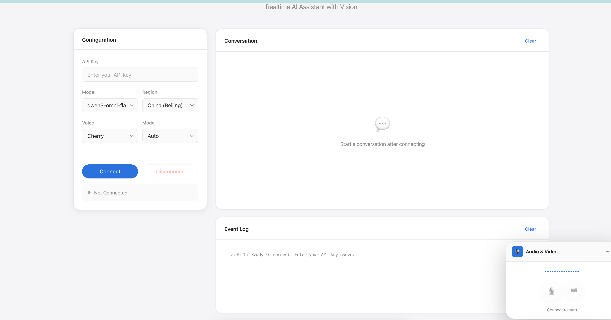

# Qwen Omni Realtime

> 基于 Qwen Omni Realtime API 的实时语音与视频对话 Web 演示

[](https://www.python.org/)
[](LICENSE)

## ✨ 特性

- 🎤 **实时语音对话** - 基于 WebSocket 的低延迟语音交互
- 📷 **视频视觉能力** - 支持摄像头画面实时传输，AI 可见你看到的内容
- 🎨 **Apple 风格界面** - 精心设计的 UI，遵循 Apple Human Interface Guidelines
- 🌗 **深色模式支持** - 自动适配系统深色/浅色模式偏好
- 🎯 **Server VAD** - 智能语音活动检测，自动判断说话结束
- 🪟 **可拖动浮窗** - 悬浮式控制面板，支持拖拽和最小化
- 🔧 **Python 代理** - 通过本地代理服务器转发，避免浏览器跨域限制

## 📸 截图

<div align="center">
  
</div>

## 🚀 快速开始

### 环境要求

- Python 3.9+
- 现代浏览器（Chrome、Edge、Safari、Firefox）

### 安装依赖

```bash
pip install aiohttp websockets
```

或使用 requirements 文件：

```bash
pip install -r requirements.txt
```

### 运行服务

```bash
cd web_demo
python -m web_demo
```

服务将在 `http://localhost:3000` 启动。

### 自定义端口

```bash
python -m web_demo --port 8080
```

### 自定义主机

```bash
python -m web_demo --host 0.0.0.0 --port 3000
```

## 📖 使用说明

1. **获取 API Key**
   - 访问 [阿里云 DashScope](https://dashscope.aliyun.com/)
   - 创建 API Key

2. **连接服务**
   - 在界面中输入 API Key
   - 选择模型和区域
   - 点击「Connect」按钮

3. **开始对话**
   - 点击麦克风按钮开始录音
   - 说话结束后自动停止（Server VAD 模式）
   - AI 将以语音和文字形式回复

4. **启用摄像头**
   - 点击摄像头按钮开启视频
   - AI 将能看到你的摄像头画面
   - 支持视觉问答和场景描述

## 🎮 功能说明

### 对话模式

| 模式 | 说明 |
|------|------|
| Auto | Server VAD 自动检测说话结束 |
| Manual | 手动点击停止按钮提交 |

### 语音选项

- Cherry（女声）
- Ethan（男声）
- Serena（女声）
- Dylan（男声）
- Ayla（女声）

### 区域选择

- 中国内地（北京）
- 海外（新加坡）

## 📁 项目结构

```
qwen-realtime-export/
├── web_demo/              # Python 代理服务器
│   ├── __init__.py
│   ├── __main__.py        # 模块入口
│   ├── app.py             # 应用工厂
│   ├── settings.py        # 配置管理
│   ├── relay.py           # WebSocket 中继
│   ├── handlers.py        # HTTP/WebSocket 处理器
│   ├── transcript_hooks.py# 转写钩子
│   └── README.md          # 本文档
└── public/                # 前端静态文件
    └── index.html         # 单页应用
```

### 模块说明

| 模块 | 职责 |
|------|------|
| `settings.py` | 配置管理（监听地址、默认模型、静态资源路径） |
| `relay.py` | WebSocket 双向透传，与 DashScope 上游通信 |
| `handlers.py` | 路由处理（`/`、`/ws-proxy`、`/api/joke`） |
| `app.py` | 应用组装，CLI 参数解析 |

## 🔧 技术栈

### 后端

- **aiohttp** - 异步 HTTP 服务器
- **websockets** - WebSocket 客户端（与 DashScope 通信）

### 前端

- **原生 JavaScript** - 无框架依赖
- **Web Audio API** - 音频采集与播放
- **MediaDevices API** - 摄像头/麦克风访问
- **WebSocket API** - 实时通信

## 🌐 API 参考

本项目基于 [Qwen Omni Realtime API](https://help.aliyun.com/zh/model-studio/realtime)，支持以下事件类型：

### 客户端事件

| 事件 | 说明 |
|------|------|
| `session.update` | 配置会话参数 |
| `input_audio_buffer.append` | 追加音频数据 |
| `input_audio_buffer.commit` | 提交音频缓冲 |
| `response.create` | 请求 AI 响应 |
| `input_image_buffer.append` | 追加图像数据 |

### 服务端事件

| 事件 | 说明 |
|------|------|
| `session.created` | 会话已创建 |
| `session.updated` | 会话已更新 |
| `input_audio_buffer.speech_started` | 检测到语音开始 |
| `input_audio_buffer.speech_stopped` | 检测到语音结束 |
| `conversation.item.input_audio_transcription.completed` | 用户语音转写完成 |
| `response.created` | AI 响应开始 |
| `response.audio_transcript.delta` | AI 文本增量 |
| `response.audio.delta` | AI 音频增量 |
| `response.done` | AI 响应结束 |

## 🐛 故障排除

### 连接失败

1. 确保代理服务器正在运行：`python -m web_demo`
2. 检查 API Key 是否正确
3. 检查网络连接和防火墙设置

### 摄像头无法访问

1. 确保浏览器已授予摄像头权限
2. 检查其他应用是否占用摄像头
3. 尝试使用 HTTPS 或 localhost

### 音频问题

1. 确保浏览器已授予麦克风权限
2. 检查系统音量设置
3. 尝试刷新页面重新连接

## 📝 开发计划

- [ ] 支持更多语音音色
- [ ] 添加语音语速调节
- [ ] 支持多轮对话上下文
- [ ] 添加对话历史导出功能
- [ ] 支持自定义系统提示词

## 🤝 贡献

欢迎提交 Issue 和 Pull Request！

## 📄 许可证

MIT License

## 🔗 相关链接

- [Qwen Omni Realtime API 文档](https://help.aliyun.com/zh/model-studio/realtime)
- [DashScope 控制台](https://dashscope.aliyun.com/)
- [阿里云模型仓库](https://github.com/QwenLM)

## 📧 联系方式

如有问题或建议，请提交 Issue。

---

⭐ 如果这个项目对你有帮助，请给它一个 Star！
